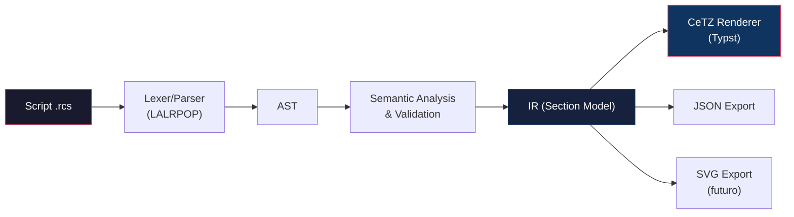

# RCSections DSL v2 — Plan de Rediseño

## Diagnóstico del Estado Actual

### Lo que funciona bien ✅
- Pipeline sólido: DSL → LALRPOP parser (Rust/WASM) → Primitivas → CeTZ (Typst)
- Sintaxis concisa para casos simples (vigas rectangulares, columnas circulares)
- Notación de acero familiar para ingenieros (`3/8"`, `#6`, `1@5 rto@20`)

### Limitaciones críticas ⚠️

| Problema | Impacto |
|---|---|
| Solo 2 formas: `Rect` y `Circle` | No soporta T, L, I, trapezoidales, ni polígonos |
| Sin geometría compuesta | Imposible modelar muros de contención, cajones de puente, etc. |
| Preprocessor frágil (indent → `{}`) | Un solo nivel de anidamiento; no soporta secciones compuestas |
| Zonas de acero fijas (`top/bot/sides/perim`) | No hay forma de colocar acero en alas, almas, o zonas arbitrarias |
| Sin cotas ni etiquetas (labels en AST pero no implementados) | El manual las documenta pero no existen en la generación |
| Sin sistema de unidades | Todo asumido en cm, sin conversión |
| Un solo tipo de estribo | Sin ganchos, estribos en U, cercos suplementarios, o rombo |

---

## Principios de Diseño del DSL v2

1. **Composición sobre enumeración**: Las formas complejas se construyen combinando regiones primitivas, no añadiendo keywords para cada geometría.
2. **Familiaridad ingenieril**: La sintaxis debe leerse como las notas de un plano estructural.
3. **Progresividad**: Un caso simple (viga rectangular) debe requerir ≤ 5 líneas. Un caso complejo (muro de contención) ≤ 30.
4. **Representación intermedia universal**: El AST → IR (JSON/CBOR) debe ser independiente del renderer. CeTZ es solo uno de los backends posibles.
5. **Extensibilidad**: Nuevos tipos de secciones se agregan sin cambiar la gramática base.

---

## Arquitectura Propuesta



### Capas del sistema

| Capa | Responsabilidad | Archivo(s) |
|---|---|---|
| **Lexer** | Tokenización con soporte de unidades, indentación | `lexer.rs` (nuevo) |
| **Parser** | Gramática LALRPOP → AST | `grammar.lalrpop` |
| **AST** | Árbol de sintaxis tipado | `ast.rs` |
| **Semantic** | Validación, resolución de defaults, herencia `set` | `semantic.rs` (nuevo) |
| **IR** | Modelo geométrico + acero resuelto (coordenadas absolutas) | `ir.rs` (nuevo) |
| **Renderer** | IR → Primitivas de dibujo (CeTZ, SVG, etc.) | `geometry.rs` refactorizado |

---

## Diseño de la Gramática v2

### 1. Estructura general del documento

```rcs
// Configuración global (opcional)
set:
    units cm                  // cm | mm | in | m
    scale section 1:25
    scale long 1:50
    cover 4
    fc 210 kgf/cm2
    fy 4200 kgf/cm2
    labels callout
    dims on

// Definición de secciones
beam "V-101":
    30 x 60
    ...

column "C-1":
    D 50
    ...
```

> [!IMPORTANT]
> El bloque `set:` define defaults heredados por todas las secciones. Cada sección puede sobreescribirlos localmente.

### 2. Tipos de elementos estructurales

```rcs
beam "id":        // Viga
column "id":      // Columna
wall "id":        // Muro/Placa
slab "id":        // Losa
footing "id":     // Zapata
pile-cap "id":    // Cabezal de pilotes
```

Cada tipo es semántico (afecta defaults de vista y estilo) pero comparte la misma gramática de propiedades.

### 3. Sistema de geometría — Formas primitivas y composición

#### 3.1 Formas primitivas (azúcar sintáctica)

```rcs
// Rectangular (atajo actual)
30 x 60

// Rectangular explícito
rect 30 60

// Circular
D 50
circle 50

// Sección T (azúcar → composición automática)
T bf:60 hf:15 bw:30 h:60

// Sección L
L bf:40 hf:15 bw:25 h:50

// Sección I (doble T)
I bf_top:60 bf_bot:60 hf_top:15 hf_bot:15 bw:30 h:80

// Trapezoidal
trap b_top:20 b_bot:40 h:50
```

#### 3.2 Composición explícita (para secciones complejas)

Para secciones que no se resuelven con azúcar sintáctica, se usa un sistema de composición por regiones:

```rcs
// Muro de contención en L
wall "M-S1":
    shape:
        // Pantalla (stem)
        region "stem":
            rect 25 300
            anchor bottom-center

        // Zapata (footing)  
        region "toe":
            rect 80 40
            anchor top-right
            attach "stem" bottom-left

        region "heel":
            rect 120 40
            anchor top-left
            attach "stem" bottom-right

    cover 5
    
    // Acero referenciado por región
    at "stem":
        inner 5 #5 @ 20      // cara interior: 5 barras #5 cada 20cm
        outer 4 #4 @ 25      // cara exterior
        ties #3 1@5 rto@15

    at "toe":
        top 3 #4
        bot 4 #5
        ties #3 rto@20
    
    at "heel":
        top 4 #5
        bot 3 #4
        ties #3 rto@20
```

#### 3.3 Geometría por polígono (máxima flexibilidad)

```rcs
// Sección de cajón de puente
beam "Cajón-P1":
    shape:
        polygon:
            (0, 0)
            (500, 0)
            (480, 30)
            (350, 30)
            (350, 170)
            (480, 170)
            (500, 200)
            (0, 200)
            (20, 170)
            (150, 170)
            (150, 30)
            (20, 30)
        
        // Huecos internos
        void "cell-1":
            polygon:
                (150, 30)
                (350, 30)
                (350, 170)
                (150, 170)
    
    cover 5
    top 10 #8 @ 15
    bot 12 #8 @ 12
```

### 4. Sistema de refuerzo — Rediseño

#### 4.1 Acero longitudinal

```rcs
// Sintaxis básica (compatible con v1)
top 3 1"                  // 3 barras de 1" arriba
bot 2 3/4" 2 1"           // 2Ø3/4" + 2Ø1" abajo (capas múltiples)
sides 2 1/2"              // 2 barras por cada cara lateral

// Sintaxis extendida: posicionamiento por zona
layer top row-1:
    3 #8                  // primera capa: 3 barras #8
layer top row-2:
    2 #6                  // segunda capa: 2 barras #6

// Distribución por espaciamiento (muros y losas)
top #4 @ 20               // barras #4 cada 20cm
bot #5 @ 15

// Perimetral (columnas)
perim 12 #6               // 12 barras #6 equidistantes

// Esquineras explícitas (columnas rectangulares)
corners 4 1"              // 4 barras de 1" en las esquinas

// Acero en zona arbitraria de una región compuesta
at "stem":
    inner #5 @ 20         // cara interna del stem
    outer #4 @ 25         // cara externa del stem

// Posicionamiento absoluto (casos especiales)
bar 1" at (5, 55)         // barra de 1" en posición exacta
bar 1" at (25, 55)
```

#### 4.2 Acero transversal (estribos)

```rcs
// Básico (compatible con v1)
ties 3/8" 1@5 5@10 rto@20

// Tipos de estribos
stirrup closed #3 1@5 5@10 rto@20      // estribo cerrado (default)
stirrup open-top #3 rto@15             // estribo abierto arriba (losa)
stirrup diamond #3 rto@10             // estribo en rombo (columna)
stirrup cross #3 rto@10              // gancho suplementario en cruz

// Estribos múltiples (columna con confinamiento)
ties:
    outer #3 1@5 5@10 rto@20          // estribo perimetral
    inner cross #3 1@5 rto@20         // ganchos suplementarios

// Estribos en espiral (columna circular)
spiral #3 pitch 5                     // espiral con paso de 5cm
```

### 5. Vistas y presentación

```rcs
// Vista única
view section               // solo corte transversal
view long                   // solo vista longitudinal

// Ambas vistas
view both                   // corte + longitudinal lado a lado

// Vista con cortes múltiples (puentes)
view:
    section at 0            // corte en el apoyo
    section at L/2          // corte en el centro del claro
    section at L            // corte en el otro apoyo
    long                    // elevación longitudinal
```

### 6. Cotas y etiquetas

```rcs
// Cotas automáticas
dims on                     // cotas exteriores (ancho × alto)
dims full                   // cotas exteriores + recubrimiento + espaciamiento de acero

// Etiquetas de acero
labels off                  // sin etiquetas
labels callout              // flechas con texto "3Ø1\""
labels legend               // leyenda debajo del dibujo
labels both                 // callout + legend
labels table                // tabla de aceros (cantidad, tamaño, longitud)
```

### 7. Propiedades de material (metadatos)

```rcs
fc 210                      // f'c en kgf/cm² (default)
fc 21 MPa                   // f'c en MPa
fy 4200                     // fy en kgf/cm²
fy 420 MPa                  // fy en MPa
```

### 8. Escala y estilo

```rcs
scale 1:25                  // escala global
scale section 1:25          // escala solo para corte
scale long 1:50             // escala solo para longitudinal

// Estilos (futuro)
style concrete gray-light   // color del concreto
style rebar colored         // acero con colores por diámetro (default)
style rebar mono            // acero monocromático
style hatch diagonal        // tipo de achurado para cortes
```

---

## Representación Intermedia (IR)

El IR es el modelo resuelto que sale del análisis semántico. Es serializable a JSON/CBOR y agnóstico al renderer.

```json
{
  "version": "2.0",
  "defaults": {
    "units": "cm",
    "cover": 4.0,
    "fc": 210.0,
    "fy": 4200.0
  },
  "sections": [
    {
      "id": "V-101",
      "kind": "beam",
      "geometry": {
        "type": "composite",
        "regions": [
          {
            "name": "main",
            "shape": {
              "type": "rect",
              "width": 30.0,
              "height": 60.0
            },
            "origin": [0.0, 0.0],
            "voids": []
          }
        ],
        "bounding_box": {
          "min": [-15.0, -30.0],
          "max": [15.0, 30.0]
        }
      },
      "cover": 4.0,
      "reinforcement": {
        "longitudinal": [
          {
            "zone": "top",
            "layer": 0,
            "bars": [
              { "size": "1\"", "diameter_cm": 2.54, "position": [-10.0, 25.5] },
              { "size": "1\"", "diameter_cm": 2.54, "position": [0.0, 25.5] },
              { "size": "1\"", "diameter_cm": 2.54, "position": [10.0, 25.5] }
            ]
          },
          {
            "zone": "bot",
            "layer": 0,
            "bars": [
              { "size": "3/4\"", "diameter_cm": 1.905, "position": [-10.0, -25.5] },
              { "size": "3/4\"", "diameter_cm": 1.905, "position": [10.0, -25.5] }
            ]
          }
        ],
        "transversal": {
          "type": "closed",
          "size": "3/8\"",
          "diameter_cm": 0.9525,
          "distribution": [
            { "type": "fixed", "count": 1, "spacing": 5.0 },
            { "type": "fixed", "count": 5, "spacing": 10.0 },
            { "type": "rest", "spacing": 20.0 }
          ],
          "path": [
            [-10.5, -25.5],
            [10.5, -25.5],
            [10.5, 25.5],
            [-10.5, 25.5]
          ]
        }
      },
      "views": ["section"],
      "presentation": {
        "scale_section": 0.04,
        "scale_long": null,
        "labels": "callout",
        "dims": false
      }
    }
  ]
}
```

> [!TIP]
> Esta IR permite que cualquier herramienta (no solo Typst/CeTZ) consuma los datos: un frontend web, un generador de DXF, un validador de norma, etc.

---

## Ejemplos Completos del DSL v2

### Ejemplo 1: Viga simple (compatibilidad con v1)

```rcs
beam "V-101":
    30 x 60
    cover 4
    top 2 1"
    bot 3 3/4"
    ties 3/8" 1@5 5@10 rto@20
```

### Ejemplo 2: Columna con confinamiento

```rcs
column "C-1":
    50 x 50
    cover 4
    fc 280
    corners 4 1"
    sides 3 3/4"
    ties:
        outer #3 1@5 6@10 rto@15
        inner cross #3 1@5 rto@15
```

### Ejemplo 3: Viga T

```rcs
beam "VT-201":
    T bf:80 hf:15 bw:30 h:55
    cover 4
    top 4 #8              // en el ala (compresión)
    bot 3 1" 2 3/4"       // en el alma (tracción)
    ties 3/8" 1@5 5@10 rto@20
```

### Ejemplo 4: Muro de contención

```rcs
set:
    units cm
    fc 210
    cover 5
    labels callout
    dims on

wall "MC-1":
    shape:
        region "pantalla":
            trap b_top:20 b_bot:30 h:300
            anchor bottom-center

        region "zapata":
            rect 200 40
            anchor top-center
            attach "pantalla" bottom-center

    at "pantalla":
        inner #5 @ 20
        outer #4 @ 25
        ties #3 1@5 rto@20

    at "zapata":
        top #4 @ 20
        bot #5 @ 15
        ties #3 rto@20
```

### Ejemplo 5: Sección de puente (viga cajón)

```rcs
set:
    units cm
    scale section 1:30
    dims on

beam "Cajón-P1":
    shape:
        region "losa-sup":
            rect 1200 25
            anchor bottom-center

        region "alma-izq":
            rect 30 175
            anchor top-right
            attach "losa-sup" bottom-left offset (50, 0)

        region "alma-der":
            rect 30 175
            anchor top-left
            attach "losa-sup" bottom-right offset (-50, 0)

        region "losa-inf":
            rect 500 20
            anchor top-center
            attach "alma-izq" bottom-right

    at "losa-sup":
        top #8 @ 12
        bot #6 @ 15

    at "alma-izq":
        inner #5 @ 20
        outer #5 @ 20
        ties #3 rto@15

    at "alma-der":
        inner #5 @ 20
        outer #5 @ 20
        ties #3 rto@15

    at "losa-inf":
        top #6 @ 15
        bot #8 @ 12
```

### Ejemplo 6: Losa aligerada

```rcs
slab "LA-1":
    rect 100 25               // ancho tributario x peralte
    cover 2.5
    
    // Viguetas
    at "vigueta":
        bot 1 1/2"
        top 1 #3
    
    // Acero de temperatura
    top #3 @ 25                // acero por temperatura
    
    view section
    labels legend
```

---

## Cambios requeridos en la Implementación

### Fase 1 — Refactorización del núcleo (mantener compatibilidad v1)

| Tarea | Archivos |
|---|---|
| Extraer lexer dedicado del parser | Nuevo: `lexer.rs` |
| Extender AST con nodos para composición | `ast.rs` |
| Añadir capa de análisis semántico + validación | Nuevo: `semantic.rs` |
| Definir IR como struct separado del AST | Nuevo: `ir.rs` |
| Refactorizar `geometry.rs` para consumir IR | `geometry.rs` |
| Añadir formas T, L, I, trapezoidal como azúcar | `grammar.lalrpop` |

### Fase 2 — Composición y regiones

| Tarea | Archivos |
|---|---|
| Gramática para `shape:` / `region` / `attach` | `grammar.lalrpop` |
| Resolver geometría compuesta → polígonos | `semantic.rs`, `ir.rs` |
| Sistema de anclaje y posicionamiento relativo | `ir.rs` |
| Acero por región (`at "nombre":`) | `grammar.lalrpop`, `ast.rs` |

### Fase 3 — Presentación y anotaciones

| Tarea | Archivos |
|---|---|
| Motor de cotas automáticas | `geometry.rs` o nuevo `annotations.rs` |
| Sistema de etiquetas (callout, legend, table) | `geometry.rs` |
| Estribos: tipos (open, diamond, cross, spiral) | `ast.rs`, `geometry.rs` |
| Achurado inteligente (por tipo de material) | `geometry.rs` |

### Fase 4 — Exportación y ecosistema

| Tarea | Archivos |
|---|---|
| Exportar IR a JSON | `lib.rs` |
| Exportar a SVG | Nuevo: `svg.rs` |
| CLI standalone (`rcs compile input.rcs -o output.json`) | Nuevo: `main.rs` |
| Validador de normas (ACI 318, Eurocódigo) | Nuevo: `validate.rs` |

---

## Gramática Formal (BNF simplificada)

```bnf
document     ::= (set_block)? section+

set_block    ::= "set" ":" INDENT property+ DEDENT

section      ::= section_type STRING ":" INDENT
                    geometry
                    property*
                  DEDENT

section_type ::= "beam" | "column" | "wall" | "slab"
               | "footing" | "pile-cap"

geometry     ::= simple_shape | composite_shape

simple_shape ::= NUM "x" NUM                              (* rect atajo *)
               | "rect" NUM NUM
               | "D" NUM | "circle" NUM
               | "T" param_list
               | "L" param_list
               | "I" param_list
               | "trap" param_list

composite_shape ::= "shape" ":" INDENT region+ DEDENT

region       ::= "region" STRING ":" INDENT
                    simple_shape
                    ("anchor" anchor_point)?
                    ("attach" STRING anchor_point ("offset" "(" NUM "," NUM ")")?)?
                 DEDENT

anchor_point ::= "top-left" | "top-center" | "top-right"
               | "center-left" | "center" | "center-right"
               | "bottom-left" | "bottom-center" | "bottom-right"

property     ::= cover | span | material | rebar | ties
               | view_prop | scale_prop | dims | labels | style

cover        ::= "cover" NUM
span         ::= "span" NUM
material     ::= ("fc" | "fy") NUM (UNIT)?

rebar        ::= zone_rebar | at_rebar | pos_rebar

zone_rebar   ::= ZONE rebar_spec+
rebar_spec   ::= NUM REBAR_SIZE
               | REBAR_SIZE "@" NUM              (* distribución *)

at_rebar     ::= "at" STRING ":" INDENT
                    face_rebar+
                 DEDENT

face_rebar   ::= FACE rebar_spec+
               | FACE NUM REBAR_SIZE

pos_rebar    ::= "bar" REBAR_SIZE "at" "(" NUM "," NUM ")"

ZONE         ::= "top" | "bot" | "sides" | "perim" | "corners" | "mid"
FACE         ::= "inner" | "outer" | "top" | "bot" | "left" | "right"

ties         ::= "ties" REBAR_SIZE spacing+
               | "ties" ":" INDENT tie_layer+ DEDENT
               | "spiral" REBAR_SIZE "pitch" NUM

tie_layer    ::= ("outer" | "inner" STIRRUP_TYPE?) REBAR_SIZE spacing+
STIRRUP_TYPE ::= "cross" | "diamond" | "open-top"

spacing      ::= NUM "@" NUM | "rto" "@" NUM

view_prop    ::= "view" VIEW_TYPE
               | "view" ":" INDENT view_entry+ DEDENT
VIEW_TYPE    ::= "section" | "long" | "both"
view_entry   ::= "section" ("at" expr)?
               | "long"

scale_prop   ::= "scale" (VIEW_TYPE)? NUM (":" NUM)?
dims         ::= "dims" ("on" | "off" | "full")
labels       ::= "labels" ("off" | "callout" | "legend" | "both" | "table")

param_list   ::= (IDENT ":" NUM)+
REBAR_SIZE   ::= "#" DIGIT+ | DIGIT+ "/" DIGIT+ '"' | DIGIT+ '"'
```

---

## Migración y Compatibilidad

> [!NOTE]
> La sintaxis actual del v1 es un **subconjunto válido** del v2. No se rompe ningún script existente.

| Sintaxis v1 | Equivalente v2 | ¿Sigue funcionando? |
|---|---|---|
| `30 x 60` | `30 x 60` / `rect 30 60` | ✅ Sí |
| `D 50` | `D 50` / `circle 50` | ✅ Sí |
| `top 3 1"` | `top 3 1"` | ✅ Sí |
| `ties 3/8" 1@5 rto@20` | `ties 3/8" 1@5 rto@20` | ✅ Sí |
| `beam "V-1":` | `beam "V-1":` | ✅ Sí |

---

## Prioridades Recomendadas

> [!IMPORTANT]
> Orden sugerido de implementación para máximo valor con mínimo esfuerzo.

1. **🔴 P0**: Formas T/L/trapezoidal como azúcar (máximo impacto, menor complejidad)
2. **🔴 P0**: Cotas automáticas (`dims on`) y etiquetas (`labels callout`)
3. **🟡 P1**: Sistema de regiones y composición (`shape:` / `region` / `at`)
4. **🟡 P1**: Tipos de estribos extendidos (open, diamond, cross)
5. **🟡 P1**: IR como JSON exportable
6. **🟢 P2**: Acero por distribución (`#5 @ 20`)
7. **🟢 P2**: Geometría por polígono
8. **🔵 P3**: Vistas múltiples y cortes en posiciones
9. **🔵 P3**: Exportación SVG, CLI standalone
